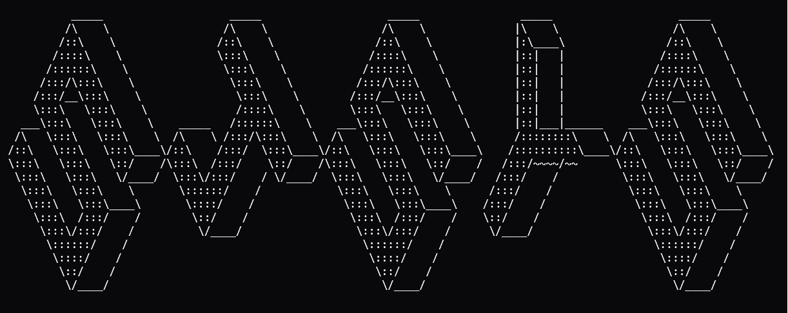

# Srihith Jarabana

My public portfolio and playground.

**Live at:** [jarabana.com](https://www.jarabana.com)

Built with React, Vite, and absolute chaos (mostly custom CSS). No component
library, no design system I didn't argue with myself about first.

If you're poking around the site rather than the source: double-click the bar
under the wordmark and type `help`. Most of the images are clickable too. There
is more in here than there appears to be, which is rather the point.

★★★★★

